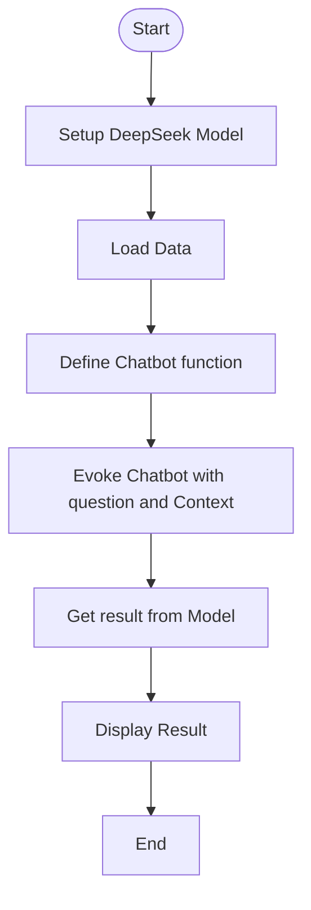

# fun-chat-ai
A terminal-based AI-powered application for fun conversations.A terminal-based AI-powered application for fun conversations.
## Technlogies
Python, Flask, SqlAlchemy
## Local Deployment
clone the project
```sh
git@github.com:tomdu3/fun-chat-ai.git
```
Navigate to the project directory
```sh
cd <project-folder>
```
Install dependencies
```sh
uv sync
```
This command creates a virtual environment (.venv) automatically and installs all project dependencies.

Run the application
```sh
uv run python main.py
```
#Flow chart 
Start ->Setup Deepseek Model->Loading data->Define the function of chatbot->Invoke chatbot with question and context->Get result from model->Display result->End


langchain
langchain-groq
langchain-community
 

###Langchain
Agent =Model +Harness
LangChain provides a minimal ,highly configurable harness.The harness is everything around the model loop:the prompt,the tools,and any middleware that shapes the behaviour.
on other hand,its a standalone framework for building agents  and third party integrations to simplify AI application development.

Longchain-groq
LanguageChain-Groqu is a connector that allows Langchain applications to use Groq-hosted Large Language models.

Langchain-community

It provides connetctors and integrations.Collection of integrations that connect Langchain applications to external datasource,tools and services.
```sh
uv add langchain lanchain-groq langchain-community

```
```sh
uv add python-dotenv
```


#Reference
https://www.youtube.com/watch?v=rfH6f1U4_kE Build a Simple Chatbot with DeepSeek
https://docs.langchain.com/oss/python/langchain/overview
LangChain overview
https://github.com/langchain-ai/langchain The agent engineering platform.


